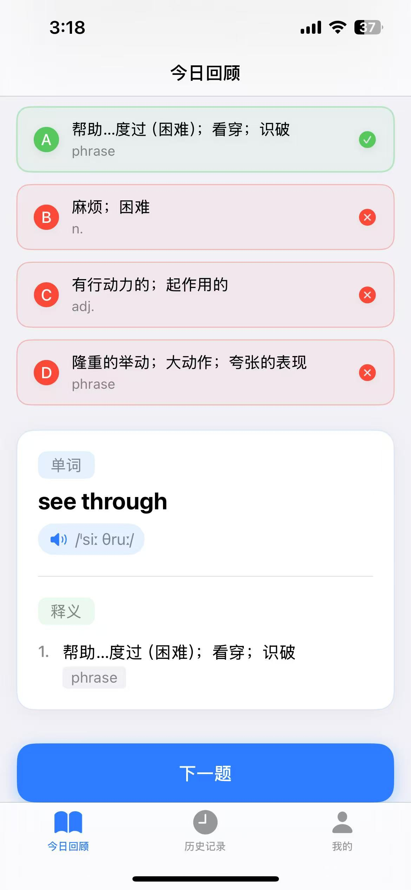
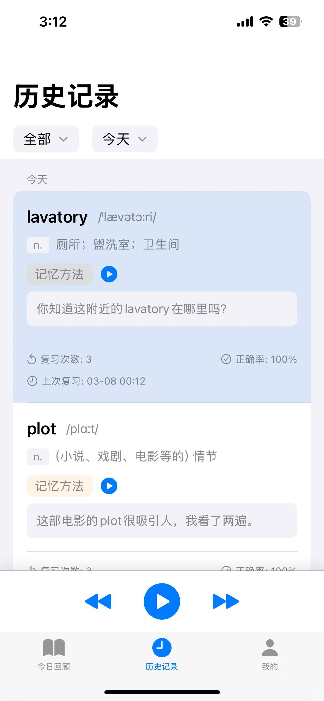
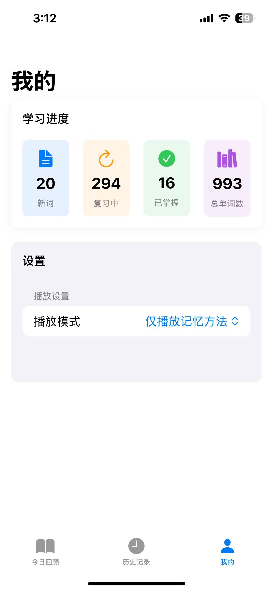

# Kumarajiva-iOS

Kumarajiva 是一款智能英语学习应用，通过间隔重复和记忆技巧帮助用户有效地记忆和复习英语词汇。

|  |  |  | 
| :---: | :---: | :---: | 
|  |  |  | 
|  |  |  | 

## 主要功能

### 1. 智能复习系统
- 个性化测验系统的每日词汇复习
- 采用间隔重复算法，确保最佳学习效果
- 交互式测验界面，即时反馈
- 追踪每次复习的学习进度

### 2. 记忆增强
- 为每个单词提供记忆技巧和情境例句
- 支持单词和记忆提示的语音发音
- 多种学习模式加强记忆：
  - 仅单词发音
  - 仅记忆方法
  - 单词和记忆方法结合

### 3. 全面的历史记录
- 详细的学习历史和复习统计
- 多种筛选选项：
  - 新学单词
  - 已掌握单词
  - 复习中的单词
  - 答错的单词
- 可视化进度展示，包含正确率
- 批量音频播放，提高复习效率

### 4. 个人进度面板
- 学习数据总览
- 进度追踪：
  - 新学单词数
  - 复习中的单词数
  - 已掌握的单词数
  - 总词汇量

## 技术要求

- iOS 15.0 或更高版本
- 支持 iPhone 和 iPad
- 需要网络连接用于单词发音和数据同步

## 安装步骤

1. 克隆代码仓库
```
git clone https://github.com/yourusername/Kumarajiva-iOS.git
```

2. 在 Xcode 中打开项目
cd Kumarajiva-iOS
open Kumarajiva-iOS.xcodeproj

3. 构建并运行应用

## 使用指南

1. **每日复习**
   - 在"今日回顾"标签页进行每日复习
   - 完成每个单词的测验
   - 查看本次学习进度和正确率

2. **历史记录**
   - 进入"历史记录"标签页
   - 按不同类别筛选单词
   - 使用批量播放功能进行音频复习
   - 查看每个单词的详细统计数据

3. **个人资料与设置**
   - 在"我的"标签页查看学习统计
   - 自定义播放设置
   - 追踪总体学习进度


