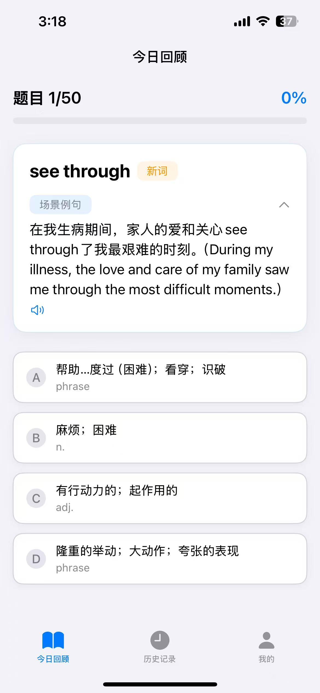

# Kumarajiva-iOS

Kumarajiva is an intelligent English learning application designed to help users effectively memorize and review English vocabulary through spaced repetition and memory techniques.


|  |  |  | 
| :---: | :---: | :---: | 
|  |  |  | 
|  |  |  | 


## Features

### 1. Smart Review System
- Daily vocabulary review with personalized quiz system
- Spaced repetition algorithm for optimal learning efficiency
- Interactive quiz interface with instant feedback
- Progress tracking for each review session

### 2. Memory Enhancement
- Memory techniques and contextual examples for each word
- Audio pronunciation support for both words and memory aids
- Multiple learning modes to reinforce memory:
  - Word pronunciation only
  - Memory method only
  - Combined word and memory method

### 3. Comprehensive History Tracking
- Detailed learning history with review statistics
- Multiple filtering options:
  - New words
  - Mastered words
  - Words under review
  - Incorrectly answered words
- Progress visualization with accuracy rates
- Batch audio playback for efficient review

### 4. Personal Progress Dashboard
- Overview of learning statistics
- Progress tracking for:
  - New words learned
  - Words under review
  - Mastered words
  - Total vocabulary count

## Technical Requirements

- iOS 15.0 or later
- iPhone and iPad compatible
- Internet connection required for word pronunciation and data synchronization

## Installation

1. Clone the repository
```
git clone https://github.com/yourusername/Kumarajiva-iOS.git
```

2. Open the project in Xcode
cd Kumarajiva-iOS
open Kumarajiva-iOS.xcodeproj


3. Build and run the application

## Usage

1. **Daily Review**
   - Access your daily review session from the "今日回顾" tab
   - Complete the quiz for each word
   - View your session progress and accuracy

2. **History Review**
   - Navigate to the "历史记录" tab
   - Filter words by different categories
   - Use batch playback for audio review
   - Check detailed statistics for each word

3. **Profile and Settings**
   - View learning statistics in the "我的" tab
   - Customize playback settings
   - Track overall learning progress


